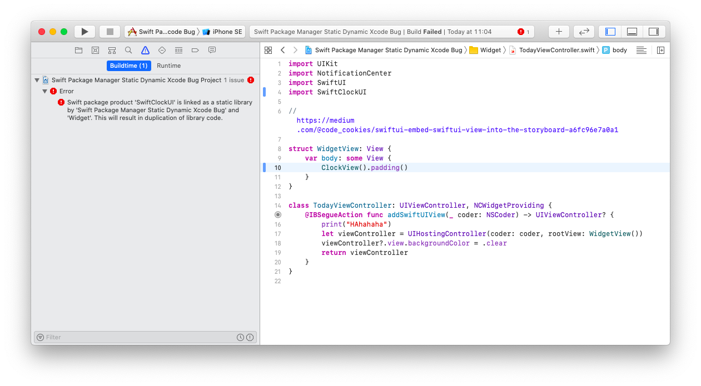
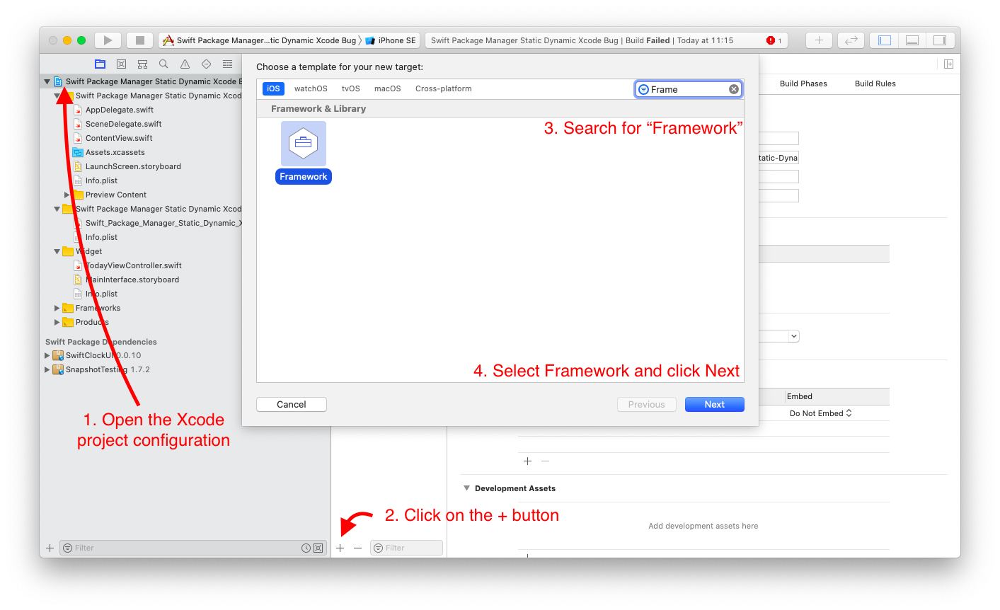
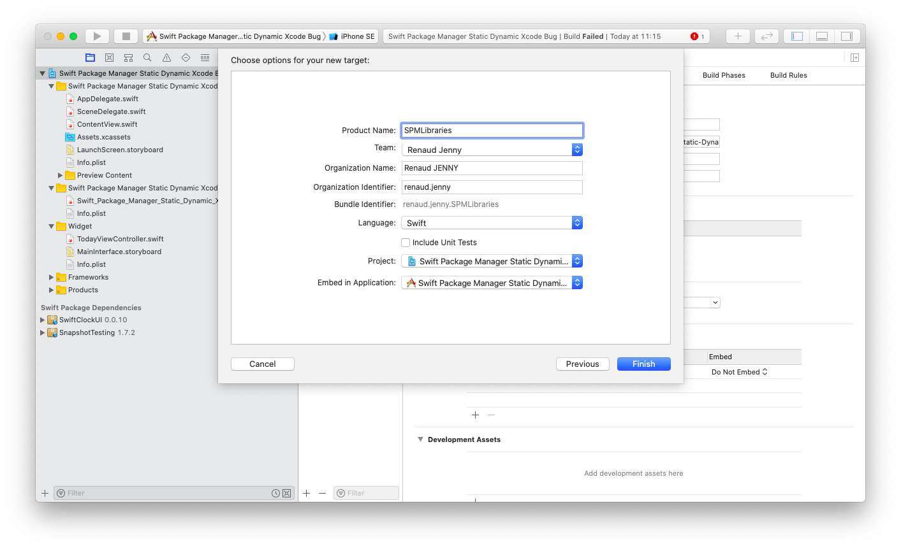

# Swift Package Manager Static Dynamic Xcode Bug

Since Xcode 11.4 and Swift 5.2 you may experience some trouble regarding SPM and compilation errors due to

* Library duplication

Create **SPMLibraries** is a possible workaround to continue using SPM with Xcode 11.4 and avoid moving all your external dependencies to `.dynamic` ones.

## Step by Step

### commit 1: *08e32fb3d4083b4bbaf49d25b72175a9a4a575a8*: project without libraries (✅ compile)

* this commit contains placeholder for the main screen and the widget

### commit 2: *35c46375496b850e751c48385d6ed41ac0486d46* add just the first external library (SwiftClockUI) with SPM for the main project (✅ compile)

* I don't try to use the external library for the Widget

* You can notice that we have already a dependencies for SnapshotTesting, keep that in mind for later.

### commit 3: *0748e832938a9ae1a383daaab0161bf1126688e1* add the same external library for the Widget (❌ won't compile)

* Add the external library to the Widget

* Library duplication: Swift package product 'your library' is linked as a static library by 'your project' and 'your widget'. This will result in duplication of library code. 😞

### commit 4: *hash* create an additional internal Framework named **SPMLibraries** (✅ compile)

* Click on the + button to add a new Framework

* Name it **SPMLibraries** or something like this (uncheck *Include Unit Tests*)

* Add all the static dependencies from SPM you need here by clicking on the + button

* ⚠️ Click on the "Allow app extension API only". It's important for Widget, instead it will be refused by the AppStore review

* In your project targets (your project and your widget), remove references to your external library (SwiftClockUI)
* Add **SPMLibraries** as a Framework

* Your project now compiles 🎉
