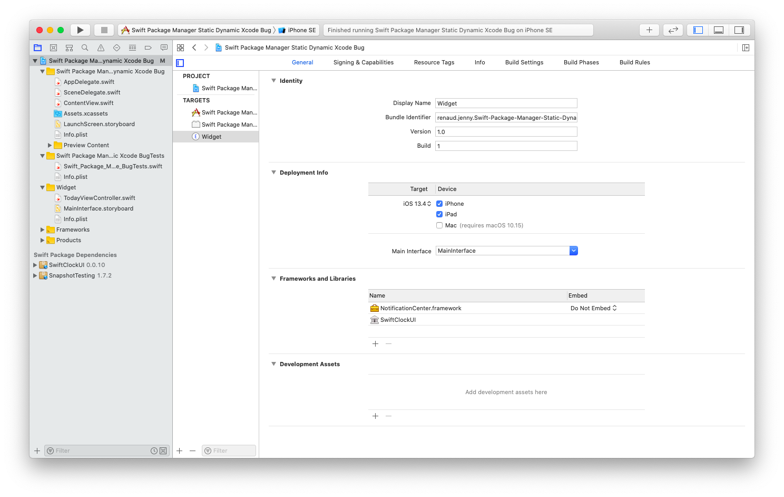
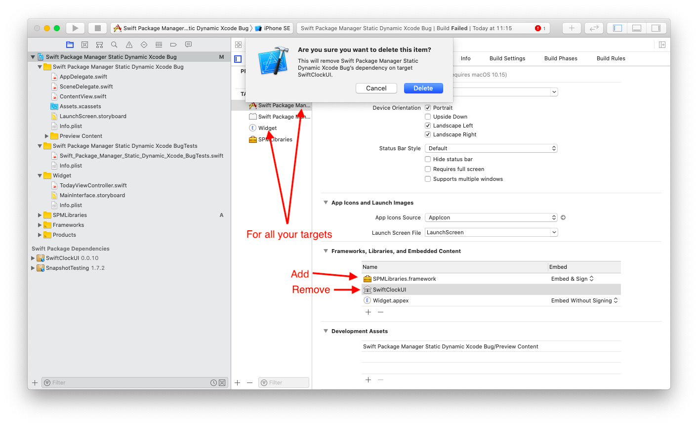
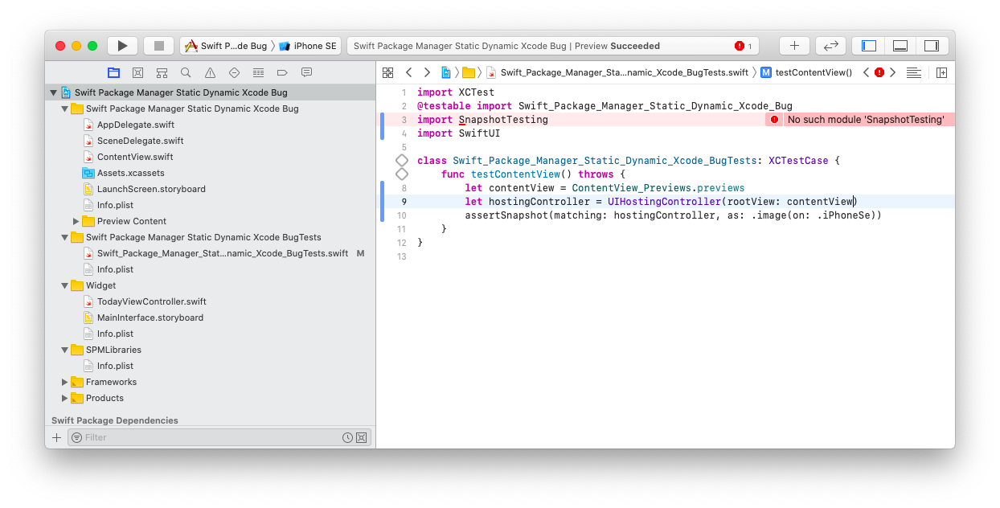
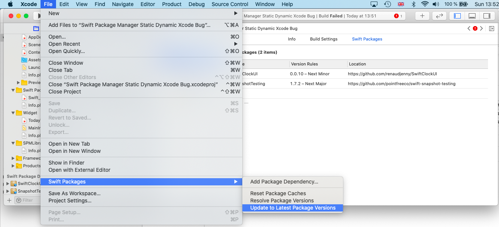
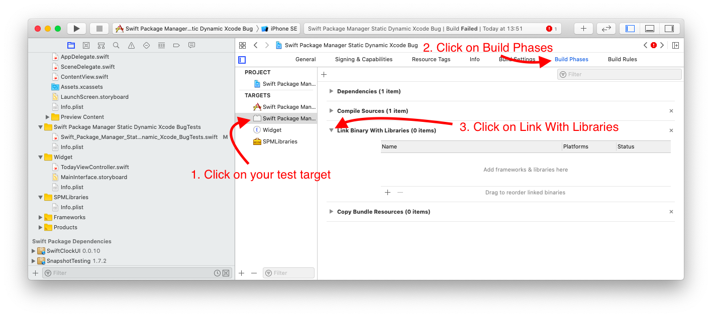
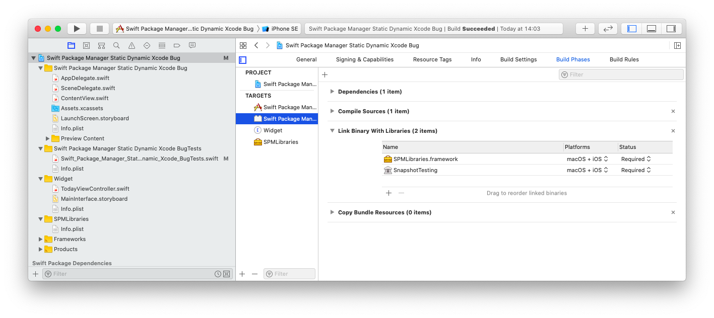
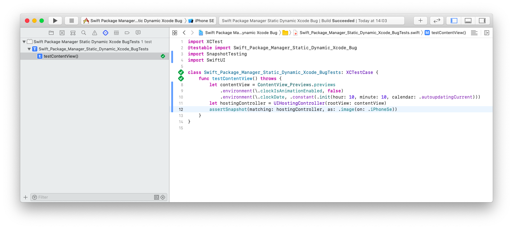

# Swift Package Manager Static Dynamic Xcode Bug

Since Xcode 11.4 and Swift 5.2 you may experience some trouble regarding SPM and compilation errors due to

* Library code duplication: **Swift package product 'your library' is linked as a static library by 'your project' and 'your widget'. This will result in duplication of library code.**
* Unable to find a library within your Unit Tests target while using dynamic libraries
* and so on related to SPM libraries

There is an open thread on Apple forum: https://forums.developer.apple.com/thread/128806 without concrete and definitive solution 😞

And on Swift forum: https://forums.swift.org/t/migrating-to-spm-from-mix-of-embedded-frameworks-and-static-libraries/34253

Also another one on Swift forums: https://forums.swift.org/t/how-to-link-a-swift-package-as-dynamic/32062 which the solution proposed by https://github.com/piercifani was the base of this step by step tutorial.

In a nutshell: since Xcode 11.4, it seems that your project will only use `.static` libraries, and if your library is present twice or more in your project (2 different targets that use the same library, for example an iOS app target and its Today Widget). You can lead to a duplication of static library. I suspect it was the case before Xcode 11.4, but no complains whatsoever... Since I applied the trick in this tutorial, my app shrunk a little in size, maybe due to the fact that my App and its Widget use the exact same code and not a duplicated one.

An easy fix is to force the library to be `.dynamic`, but it requires either to ask the library maintainer to update his `Package.swift` definition, or fork the library yourself to do so. For me, it's not a solution 🤔.

I tried this first as all my libraries I used in my project was mine. It worked 🎉. But my Unit Tests refused to compile 🤬. Because I used the same library for doing Snapshot Testing in both UI library and my main project...

IMHO it's an Xcode issue. Because in SPM documentation, it's mentioned that if you don't want to force either `.dynamic` or `.static` you can let blank and it will be automatically manager by the SPM consumer (a.k.a Xcode in our case). Xcode should be smart enough to detect that a SPM library is used twice or more and apply the `.dynamic` itself or something.

Create **SPMLibraries** is a possible workaround to continue using SPM with Xcode 11.4 and avoid moving all your external dependencies to `.dynamic` ones.

## Step by Step

Step 1 to 3 is only to create a new project from scratch to reproduce the problem.

You can jump directly to step 4 to get the workaround immediately

### Step 1: project without libraries

* this commit contains placeholder for the main screen and the widget

### Step 2: add just the first external library (SwiftClockUI) with SPM for the main project

* I don't try to use the external library for the Widget yet

* You can notice that we have already a dependencies for SnapshotTesting, keep that in mind for later.

### Step 3: add the same external library for the Widget (❌ won't compile)

* Add the external library to the Widget

* Library duplication: Swift package product 'your library' is linked as a static library by 'your project' and 'your widget'. This will result in duplication of library code. 😞

### Step 4: create an additional internal Framework named **SPMLibraries**

* Click on the + button to add a new Framework

* Name it **SPMLibraries** or something like this (uncheck *Include Unit Tests*)

* Add all the static dependencies from SPM you need here by clicking on the + button

* ⚠️ Click on the "Allow app extension API only". It's important for Widget, instead it will be refused by the AppStore review

* In your project targets (your project and your widget), remove references to your external library (SwiftClockUI)

* Add **SPMLibraries** as a Framework
* Your project now compiles 🎉

### Step 5: add common libraries into Unit Tests target

If you're using the same library as one of your dependency already use, you will have a library conflict.

* My project use **SnapshotTesting library** from [Point-Free](https://github.com/pointfreeco/swift-snapshot-testing)
* One of my library use it as well... so I've already this dependency in my project, indirectly though
* My Unit Tests target is unable to access directly to **SnapshotTesting** 😞 with a "No such module 'SnapshotTesting'"
* Tests won't compile and run...

Here is the steps to follow to get the workaround

#### Step 1: Add your common dependency as a SPM package in your main project (even if it's indirectly already there)

* ❗️ For library like this one, you shouldn't link it with your project, so uncheck this while SPM/Xcode ask you which target you want
* ⚠️ don't forget to update to last package version!

#### Step 2: Link common libraries with your Unit Tests target manually

* You need to go to "Build Phases" and add libraries that Unit Tests will use manually

* Add SPMLibraries framework as well

* And here we are 🎉🎉🎉

